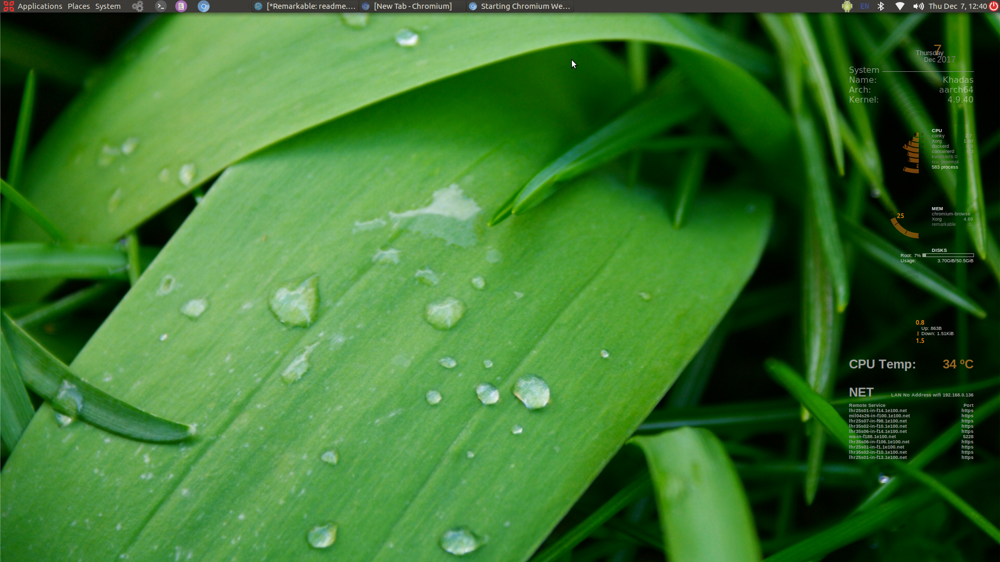

### How to install conky on Khadas Vim2 ###

-- open a terminal.....
-- sudo apt-get install conky-all -y
-- sudo apt-get install git -y
-- cd~/
-- git clone https://github.com/wSmithyeah/KhadasVim2conky.git

*** setup up autostart for it ***
+ use the menu

    system
      preferences
         personal
            startup applications
 
**add the following command line item to the list**
conky --font=/home/khadas/.config/conky/Arial.ttf --config /home/khadas/.config/conky/ConkyNew --pause=5

